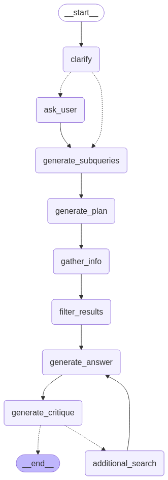

# Hekmatica

`Hekmat` means wisdom and philosophy in Persian.

Hekmatica is adeep research and conversational agent designed to answer questions on various topics by leveraging web search, external tools (like price lookups), and large language models (LLMs).

## Overview

This agent uses a structured workflow orchestrated by LangGraph to:
1.  Understand and potentially clarify the user's question.
2.  Break down the question into searchable subqueries.
3.  Plan which tools (web search, price lookup) to use.
4.  Gather information using the selected tools.
5.  Filter and rank the gathered information for relevance.
6.  Synthesize a comprehensive answer based on the relevant information.
7.  Critique its own answer and potentially refine it by performing additional searches.

The agent leverages BAML (Boundary Markup Language) to define and manage interactions with LLMs for tasks like planning, ranking, and generation.

## Architecture

*   **Orchestration:** LangGraph (`agent.py`) manages the flow of execution through different states and nodes.
*   **LLM Interaction:** BAML (`baml_src/`) defines the prompts, functions, and data structures for interacting with LLMs reliably.
*   **Tools:** Custom Python functions (`tools.py`) provide capabilities like web search and cryptocurrency price lookups.
*   **State Management:** A Pydantic model (`AgentState` in `agent.py`) holds the data passed between steps in the LangGraph workflow.

## Components

### `agent.py`
*   Defines the `AgentState` class to track the agent's progress.
*   Implements the core agent logic using a `langgraph.StateGraph`.
*   Contains node functions for each step of the workflow:
    *   `clarify_node`: Checks if the question needs clarification.
    *   `ask_user_node`: Prompts the user for clarification (interactive).
    *   `generate_subqueries_node`: Breaks the question into subqueries (using BAML).
    *   `plan_node`: Plans tool usage for subqueries (using BAML).
    *   `gather_info_node`: Executes the plan using tools from `tools.py`.
    *   `filter_results_node`: Ranks and filters search results (using BAML).
    *   `answer_node`: Generates the final answer (using BAML).
    *   `critique_node`: Critiques the generated answer (using BAML).
    *   `additional_search_node`: Performs follow-up searches based on critique.
*   Includes the `DeepResearchAgent` class to encapsulate the graph and execution logic.
*   Provides a `main` block to run the agent from the command line.

### `tools.py`
*   `web_search(query, max_results)`: Performs a general web search using DuckDuckGo and returns a list of results (content and link).
*   `get_current_price(coin_name)`: Fetches the current price of a specific item (initially implemented for cryptocurrencies using CoinGecko API) in USD. This demonstrates how specialized lookup tools can be added. Supports common crypto names and symbols (e.g., "bitcoin", "BTC", "ethereum", "ETH").

### `baml_src/` (BAML Definitions)
This directory contains the BAML files that define the structure and logic for interacting with LLMs:
*   `clients.baml`: Configures the LLM clients (e.g., API keys, model names).
*   `generators.baml`: May contain reusable BAML code snippets or configurations.
*   `clarify_question.baml`: Defines the LLM function to analyze the user's question and ask for clarification if needed.
*   `generate_subqueries.baml`: Defines the LLM function to generate relevant search subqueries.
*   `plan_steps.baml`: Defines the LLM function to create a step-by-step plan involving tool usage.
*   `rank_results.baml`: Defines the LLM function to rank search results based on relevance to the query.
*   `answer_question.baml`: Defines the LLM function to synthesize a final, cited answer from the gathered context.
*   `critique_answer.baml`: Defines the LLM function to evaluate the generated answer for quality and completeness.

## Workflow



The agent follows these steps, managed by LangGraph:

1.  **Clarify:** Analyze the input question. If ambiguous, generate a clarifying question.
2.  **Ask User (Conditional):** If clarification is needed, prompt the user and wait for input.
3.  **Generate Subqueries:** Break down the (potentially clarified) question into smaller, searchable queries.
4.  **Plan:** Determine which tool (`WebSearch` or `PriceLookup`) to use for each subquery.
5.  **Gather Info:** Execute the plan, calling the appropriate tools (`web_search`, `get_current_price`).
6.  **Filter Results:** Use an LLM to rank the gathered information (search results, prices) and select the most relevant items.
7.  **Generate Answer:** Synthesize a comprehensive answer based on the filtered, relevant information, including citations/sources where available.
8.  **Critique:** Evaluate the generated answer.
9.  **Refine (Conditional):** If the critique identifies missing information and the attempt limit hasn't been reached, perform an additional web search for the missing details and loop back to generate an improved answer.
10. **End:** Return the final answer.

## Setup

1.  **Clone the repository:**
    ```bash
    git clone git@github.com:kargarisaac/crypto_deep_research_agent.git
    cd crypto_deep_research_agent
    ```
2.  **Install dependencies:** This project uses Poetry for dependency management.
    ```bash
    poetry install
    ```
    *(If you don't have Poetry, install it first: [https://python-poetry.org/docs/#installation](https://python-poetry.org/docs/#installation))*
3.  **Configure BAML:**
    *   Ensure your BAML `clients.baml` (or equivalent configuration in `baml_src/`) is set up with the necessary LLM API keys (e.g., Gemini, OpenAI, Anthropic). Refer to BAML documentation for configuration details.
    *   Generate the BAML client code if you haven't already or if you modify BAML files:
        ```bash
        baml-cli init
        ```
4.  **Environment Variables:** Ensure any required API keys (e.g., for LLMs via BAML) are available as environment variables in your shell session or a `.env` file.

## Usage

Run the agent script directly from your terminal, providing your question:

```bash
python agent.py --question "<your question>"
```

The script will execute with the provided question (or a default general question if none is provided). It will prompt you for input if clarification is needed and then print the final answer generated by the agent.

You can also modify the default `user_question` within the `if __name__ == "__main__":` block in `agent.py`.

## Development & Cursor Integration (Optional)

The following instructions are for setting up MCP (Model Context Protocol) servers for interacting with BAML and LangGraph documentation within the Cursor IDE during development. This is *not* required to simply run the agent.

### Activate MCP servers for BAML/LangGraph Documentations

- Run the BAML MCP server:
  ```bash
  poetry run mcpdoc --urls BAMLDocs:https://docs.boundaryml.com/llms.txt \
    --transport sse \
    --port 8083 \
    --host localhost \
    --allowed-domains 'https://docs.boundaryml.com'
  ```

- Run the LangGraph MCP server:
  ```bash
  poetry run mcpdoc --urls LangGraphDocs:https://langchain-ai.github.io/langgraph/llms.txt \
    --transport sse \
    --port 8084 \
    --host localhost \
    --allowed-domains 'https://langchain-ai.github.io/'
  ```

- Inspect the server and test:
  ```bash
  npx @modelcontextprotocol/inspector
  ```

### Set MCP Servers on Cursor
- Add the following to your Cursor `mcp.json` file (usually found via `Cmd/Ctrl + Shift + P` -> `Open User Settings (JSON)` -> Search for `mcp.json`):
  ```json
  {
    "mcpServers": {
      "baml-docs": {
        "url": "http://localhost:8083/sse"
      },
      "langgraph-docs": {
        "url": "http://localhost:8084/sse"
      }
    }
  }
  ```
- Ensure the servers are running in your terminal and enabled in Cursor (check the AI settings / MCP Server status).

### Cursor Rules
Use these rules in Cursor's agent prompt when asking questions about BAML or LangGraph development in this project:

```txt
# BAML
When asked about BAML, use the "baml-docs" MCP server:
- Call the list_doc_sources tool to find available documentation sources.
- Call the fetch_docs tool to open the BAML docs index (baml_llms.txt).
- Examine the list of documentation topics for relevance.
- Call fetch_docs on the relevant documentation URL(s) to get details.
- Use the retrieved documentation content to answer the question.
```

```txt
# LangGraph
When asked about LangGraph, use the "langgraph-docs" MCP server:
- Call the list_doc_sources tool to find available documentation sources.
- Call the fetch_docs tool to open the LangGraph docs index (https://langchain-ai.github.io/langgraph/llms.txt).
- Examine the list of documentation topics for relevance.
- Call fetch_docs on the relevant documentation URL(s) to get details.
- Use the retrieved documentation content to answer the question.
```

## TODO

- [ ] Add template for output and check in the critique
- [ ] Explore [browser use](https://github.com/browser-use/browser-use). 
- [ ] Expand Toolset: Integrate more tools (calculator, specific APIs like arXiv, etc.).
- [ ] Generalize `PriceLookup`: Modify the tool/mapping to handle more item types (stocks, products) or create a system for adding new lookups.
- [ ] Enhance Planning: Improve tool selection logic in `plan_steps.baml` for a larger toolset.
- [ ] Dynamic Planning: Allow the execution plan to adapt based on intermediate results.
- [ ] Multi-step Reasoning: Enable more complex sequences of tool use and information synthesis.
- [ ] Robust Tool Error Handling: Improve error handling in `gather_info_node` (retries, alternatives).
- [ ] LLM Output Validation: Add validation/retries for BAML function calls.
- [ ] Contradiction Detection: Add logic to identify and handle conflicting information from sources.
- [ ] Nuanced Critique: Make `critique_answer.baml` check for accuracy, style, specific constraints.
- [ ] Confidence Scoring: Have the agent output a confidence score for its final answer.
- [ ] Conversational Memory: Add state/logic to handle follow-up questions and conversational context.
- [ ] Streaming Output: Implement streaming for the final answer generation.
- [ ] Enhanced Evaluation Suite: Develop a comprehensive test suite for diverse questions.
- [ ] Integrate Robust Scraping Service (e.g., Firecrawl): For reliable extraction from complex/dynamic pages identified by search.
- [ ] Explore Vision-Based Scraping: Leverage multimodal models to extract data from visual page layouts, bypassing traditional scraping blocks.
